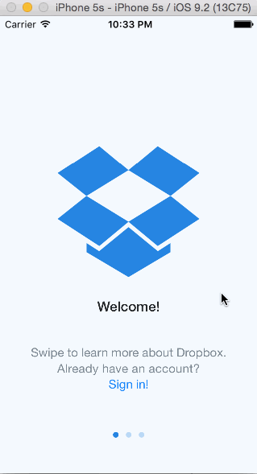

# Week 1 Project: Dropbox
The purpose of this project is to use Xcode to implement the flow between the screens of an application. 

Time spent: #16 hours

#Project Requirements

 - User can tap through the 3 welcome screens.
 - User can follow the create user flow.
    - On the create user form, the user can tap the back button to go to the page where they can sign in or create an account.
    - Before creating the account, user can choose to read the terms of service.
 - After creating the account, user can view the placeholders for Files, Photos, and Favorites as well as the Settings screen.
 - User can log out from the Settings screen.
 - User can follow the sign in flow.
   - User can tap the area for "Having trouble signing in?"
   - User can log out from the Settings screen.
 - Optional: Swipe through the welcome screens instead of just tapping them.
 - Additional: Sign In button on initial welcome screen (Welcome1) is linked to the sign in flow.
 - Additional: Sign In button on third welcome screen (Welcome3) is linked to the sign in flow.
 

#Demo GIFs

#License
Licensed under the Apache License, Version 2.0 (the "License"); you may not use this file except in compliance with the License.

You may obtain a copy of the License at: http://www.apache.org/licenses/LICENSE-2.0

Unless required by applicable law or agreed to in writing, software distributed under the License is distributed on an "AS IS" BASIS, WITHOUT WARRANTIES OR CONDITIONS OF ANY KIND, either express or implied.

See the License for the specific language governing permissions and limitations under the License.
